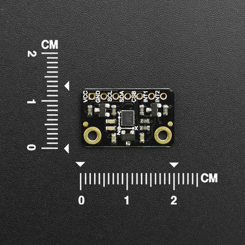

# DFRobot_BMX160

- [中文版](./README_CN.md)

The BMX160 is a highly integrated, low power 9-axis sensor that provides precise acceleration and angular rate (gyroscopic) and geomagnetic measurement in each spatial direction.<br>
The BMX160 contains 16 bit digtial,triaxial accelerometer 16 bit digital, triaxial gyroscope and geomagnetic sensor.<br>
This example is for BMX160 sensor and it oprated via Arduino I2C.



## Product Link(https://www.dfrobot.com/product-2141.html)

    SKU：SEN0373

## Table of Contents

* [Summary](#summary)
* [Installation](#installation)
* [Methods](#methods)
* [Compatibility](#compatibility)
* [History](#history)
* [Credits](#credits)

## Summary

Provide an Arduino library to control the bmx160 to get magnetometer accelerometer, gyroscope and step counter, via I2C communication.

## Installation

There are two ways to use the library:
1. Open the Arduino IDE, search for "DFRobot_BMX160" in Tools --> Manager Libraries on the status bar, and install the library.
2. First download the library file, paste it into the \Arduino\libraries directory, then open the examples folder and run the demo in that folder.

## Methods

```C++
    /**
     * @fn begin
     * @brief set the i2c addr and init the i2c.
     * @return returns the initialization status
     * @retval true Initialization succeeded
     * @retval false Initialization  failed
     */
    bool begin();

    /**
     * @fn setGyroRange
     * @brief set gyroscope angular rate range and resolution.
     * @param bits 
     * @n       eGyroRange_2000DPS     Gyroscope sensitivity at 2000dps
     * @n       eGyroRange_1000DPS     Gyroscope sensitivity at 1000dps
     * @n       eGyroRange_500DPS      Gyroscope sensitivity at 500dps
     * @n       eGyroRange_250DPS      Gyroscope sensitivity at 250dps
     * @n       eGyroRange_125DPS      Gyroscope sensitivity at 125dps
     */
    void setGyroRange(eGyroRange_t bits);

    /**
     * @fn setAccelRange
     * @brief allow the selection of the accelerometer g-range.
     * @param bits 
     * @n       eAccelRange_2G        Macro for mg per LSB at +/- 2g sensitivity (1 LSB = 0.000061035mg) 
     * @n       eAccelRange_4G        Macro for mg per LSB at +/- 4g sensitivity (1 LSB = 0.000122070mg) 
     * @n       eAccelRange_8G        Macro for mg per LSB at +/- 8g sensitivity (1 LSB = 0.000244141mg) 
     * @n       eAccelRange_16G       Macro for mg per LSB at +/- 16g sensitivity (1 LSB = 0.000488281mg)
     */
    void setAccelRange(eAccelRange_t bits);
    
    /**
     * @fn getAllData
     * @brief get the magn, gyro and accel data 
     * @param magn  to store the magn data
     * @param gyro  to store the gyro data
     * @param accel  to store the accel data
     */
    void getAllData( sBmx160SensorData_t *magn,  sBmx160SensorData_t *gyro,  sBmx160SensorData_t *accel);

    /**
     * @fn softReset
     * @brief reset bmx160 hardware
     * @return returns the reset status
     * @retval true reset succeeded
     * @retval false reset  failed
     */
    bool softReset();

    /**
     * @fn setLowPower
     * @brief disabled the the magn, gyro sensor to reduce power consumption
     */
    void setLowPower();

    /**
     * @fn wakeUp
     * @brief enabled the the magn, gyro sensor
     */
    void wakeUp();
```

## Compatibility

| Board         | Work Well | Work Wrong | Untested | Remarks |
| ------------- | :-------: | :--------: | :------: | ------- |
| Arduino uno   |     √     |            |          |         |
| Mega2560      |     √     |            |          |         |
| Leonardo      |     √     |            |          |         |
| ESP32         |     √     |            |          |         |
| micro:bit     |     √     |            |          |         |
| FireBeetle M0 |     √     |            |          |         |


## History

- 2021/10/20 - Version 1.0.1 released.
- 2019/06/25 - Version 1.0.0 released.

## Credits

Written by Fary(feng.yang@dfrobot.com), 2021. (Welcome to our [website](https://www.dfrobot.com/))


